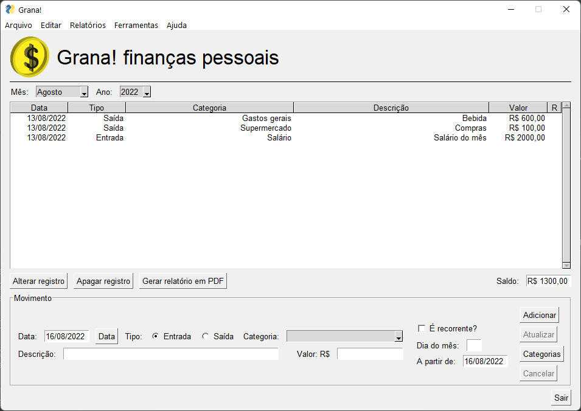

## **Grana!** 
Um gerenciador de finanças pessoais simples e fácil de usar.

**Grana!** é um aplicativo bastante simplificado, mas que cumpre a função de gerenciamento financeiro pessoal. Muito simples de usar e fácil de entender, ele foi criado para suprir uma necessidade pessoal, e agora está sendo lançado publicamente.

A diferença entre **Grana!** e outros gerenciadores de finanças existentes é principalmente a simplicidade. Baseado em uma planilha de excel, o programa é de fácil compreensão e enxuto, com apenas as funcionalidades necessárias para um controle financeiro pessoal.

**Grana!** está sendo revisado e alterado, e no momento tem as seguintes funcionalidades:

- Criação do banco de dados na primeira utilização;
- Inclusão, alteração e exclusão de lançamentos;
- Inclusão, alteração e exclusão de lançamentos recorrentes;
- Total mensal de gastos;
- Gráficos;
- Categorias de gastos.
- Totais baseados em categorias;

As próximas versões receberão:

- Exclusão de lançamentos por categoria;
- Geração de relatórios PDF;
- Entre outros.

Logo atualizarei este readme com mais informações.
